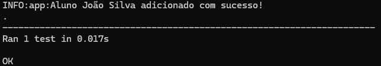
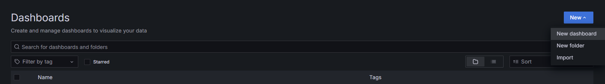
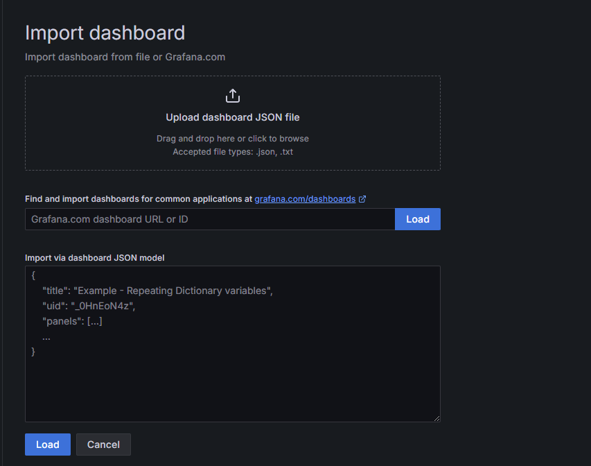
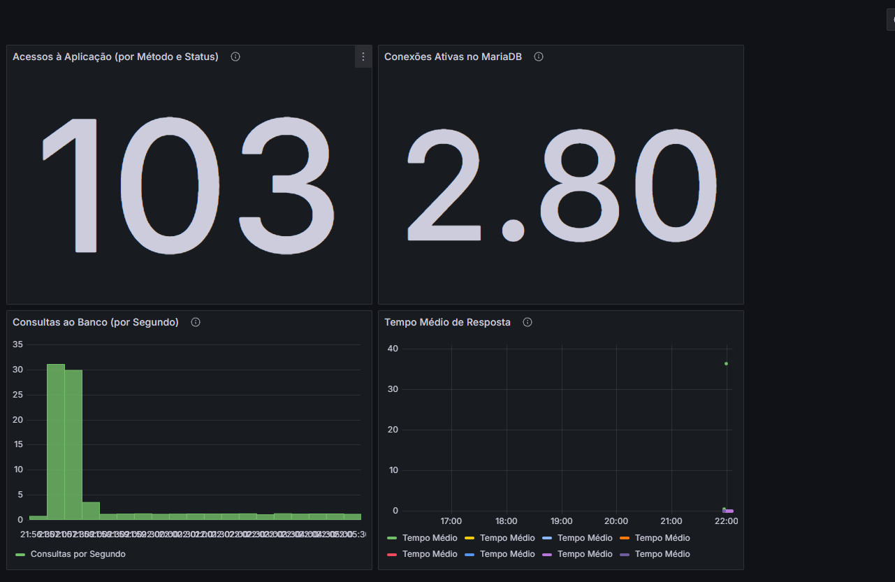

# **Monitoramento de Aplicação Flask com Prometheus e Grafana**

Este projeto implementa uma aplicação Flask monitorada em tempo real utilizando Prometheus para coleta de métricas e Grafana para visualização. O sistema monitora as requisições HTTP da aplicação Flask, o desempenho do MariaDB, e o tempo de resposta da aplicação.

---

## **Tecnologias Utilizadas**

- **Flask**: Framework Python para desenvolvimento da aplicação web.
- **Prometheus**: Sistema de monitoramento e coleta de métricas.
- **Grafana**: Ferramenta para visualização e criação de dashboards de monitoramento.
- **Docker**: Para gerenciamento de contêineres e ambientes isolados.
- **Docker Compose**: Para orquestrar múltiplos contêineres Docker de forma simples.

---

## **Requisitos**

Certifique-se de ter os seguintes softwares instalados no seu sistema:

- [Docker](https://www.docker.com/)
- [Docker Compose](https://docs.docker.com/compose/)
- [Git](https://git-scm.com/)

---

## **Instalação e Execução**

### 1. Clone o repositório

Clone este repositório para sua máquina local e navegue até o diretório do projeto:

```bash
git clone https://github.com/wesley-andrade/Trabalho_DevOps_23100191.git
cd Trabalho_DevOps_23100191
```

### 2. Construa e inicie os contêineres

Execute o comando abaixo para construir as imagens Docker e iniciar os contêineres em segundo plano:

```bash
docker-compose up --build -d
```

### 3. Acesse os serviços

Após a inicialização, você pode acessar os seguintes serviços através dos seguintes links:

- **Aplicação Flask**: [http://localhost:5000](http://localhost:5000)
- **Prometheus**: [http://localhost:9090](http://localhost:9090)
- **Grafana**: [http://localhost:3000](http://localhost:3000)

---

## **Testando a Aplicação**

### 1. Executando os testes unitários

Dentro do contêiner da aplicação Flask, execute os testes unitários para garantir que o código esteja funcionando corretamente:

```bash
docker-compose exec flask_app python3 -m unittest discover -s /app/tests -p "test_*.py"
```

### 2. Verificando os resultados

Após a execução, os resultados dos testes serão exibidos no terminal. Certifique-se de que todos os testes passaram com sucesso. Aqui está um exemplo de como a saída pode ser:



---

## **Integrando com Jenkins**

### Configurando o Pipeline no Jenkins

1. Acesse o Jenkins e crie uma nova tarefa do tipo _Pipeline_.

   

2. Na configuração do pipeline, adicione o repositório Git com o link do repositório:

   ```
   https://github.com/wesley-andrade/Trabalho_DevOps_23100191.git
   ```

   Selecione a branch `main`.

   

3. Execute o pipeline clicando em "Construir Agora".

   

4. Confira o status da execução no Jenkins.

   

---

## **Monitoramento com Grafana**

### 1. Acessando o Grafana

Acesse o Grafana através do endereço [http://localhost:3000](http://localhost:3000). Após login (usuário: admin, senha: admin), clique em "Dashboard" e crie um novo painel.



### 2. Importando o Dashboard

Clique em "Upload dashboard JSON file" e selecione o arquivo `mariadb_dashboard.json`, localizado em `grafana/provisioning/dashboards/`.



Dê um nome para o dashboard e clique em "Importar".

### 3. Verificando os Dados

Após importar o dashboard, você verá os gráficos com os dados coletados em tempo real. O Grafana exibirá métricas como:

- Taxa de requisições HTTP
- Tempo médio de resposta da aplicação
- Consultas ao banco de dados MariaDB
- Número de conexões ativas no MariaDB

  

---

## **Resumo**

Com este projeto, você poderá:

- Monitorar em tempo real o desempenho da sua aplicação Flask e do banco de dados MariaDB.
- Visualizar métricas importantes como tempo de resposta, requisições HTTP e consultas SQL utilizando Grafana.
- Automatizar o processo de integração contínua (CI) com Jenkins para garantir que a aplicação esteja sempre funcionando corretamente.

Este ambiente de monitoramento facilita a análise do desempenho da aplicação e do banco de dados, além de proporcionar uma visão clara sobre a saúde do sistema.
