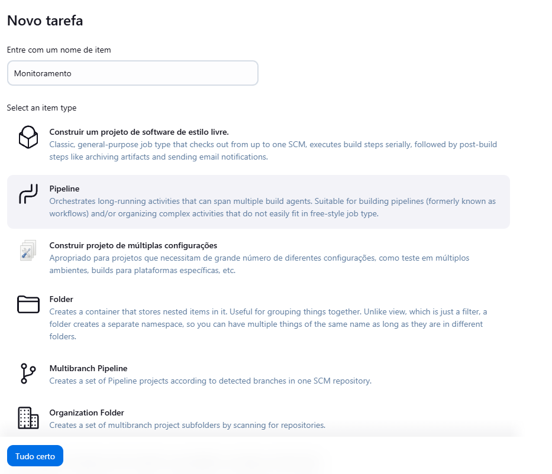

Aqui está o README com os ajustes solicitados:

---

# **Monitoramento de Aplicação Flask com Prometheus e Grafana**

Este projeto implementa uma aplicação Flask monitorada em tempo real usando Prometheus e Grafana. O sistema coleta métricas de requisições HTTP, desempenho da aplicação e banco de dados MariaDB.

---

## **Tecnologias Utilizadas**

- **Flask**: Framework web para criar a aplicação.
- **Prometheus**: Ferramenta para coleta e armazenamento de métricas.
- **Grafana**: Ferramenta para visualização e monitoramento.
- **Docker e Docker Compose**: Para gerenciamento de contêineres.
- **MariaDB**: Banco de dados relacional.

---

## **Requisitos**

Certifique-se de ter os seguintes softwares instalados no sistema:

- [Docker](https://www.docker.com/)
- [Docker Compose](https://docs.docker.com/compose/)
- [Git](https://git-scm.com/)

---

## **Instalação e Execução**

1. Clone este repositório:

   ```bash
   git clone https://github.com/wesley-andrade/Trabalho_DevOps_23100191.git
   cd Trabalho_DevOps_23100191
   ```

2. Construa e inicie os contêineres:

   ```bash
   docker-compose up --build -d
   ```

3. Acesse os serviços:
   - **Aplicação Flask**: [http://localhost:5000](http://localhost:5000)
   - **Prometheus**: [http://localhost:9090](http://localhost:9090)
   - **Grafana**: [http://localhost:3000](http://localhost:3000)

---

## **Testando a Aplicação**

1. Execute os testes unitários dentro do container:

   ```bash
   docker-compose exec flask_app python3 -m unittest discover -s /app/tests -p "test_*.py"
   ```

2. Verifique os resultados no terminal. Certifique-se de que todos os testes passaram.

   

## **Utilizando o Jenkins**

### Configurando o Pipeline no Jenkins

1. Acesse o Jenkins e crie uma nova tarefa do tipo _Pipeline_.

   

2. Configure o repositório Git:

   - Use o link do seu repositório:
     ```
     https://github.com/wesley-andrade/Trabalho_DevOps_23100191.git
     ```
   - Selecione a branch `main`.

   

3. Execute a tarefa clicando em "Construir Agora".

   

4. Confira o status da execução no Jenkins.

   

---
